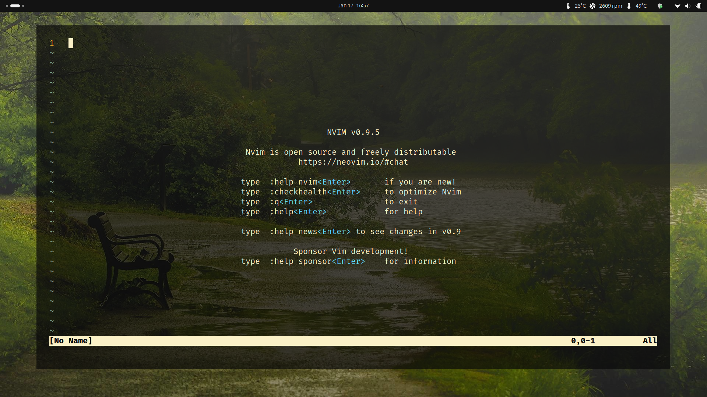

# dotfiles

These are a few config files for my setup. I mostly use Ubuntu LTS.

Currenlty this repo contains configs for:

1. alacritty terminal
2. zed editor
3. vim / nvim editor

I will be adding more soon. I started this repo just for a few friends of mine who keep asking me for same config files. 

I also a have an [Obsidian.md](https://github.com/ramdeoshubham/obsidian-garden-toolkit) Setup if you are interested.
